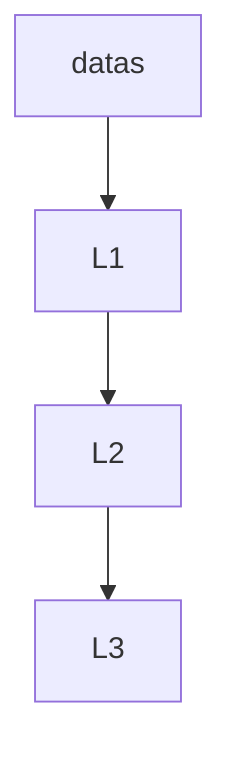

# 第1章 React 简介

## 1.1 React 概述

​	React是一个用于构建用户页面的js库，专注于视图，实现组件化开发。主要用来写HTML页面或者构建Web应用，起源于Facebook内部项目，可以进行安卓、ios移动端开发，使用虚拟**Dom**和**Diffing**算法，尽量减少与真实dom的交互提高性能。

**React 框架的主要优点：**

- 声明式设计：React采用声明范式，可以轻松描述应用。
- ​        高  效：React通过DOM的模拟，最大限度地减少与DOM的交互。
- ​        灵  活：React可以与已知的库或框架很好地配合。
-    JSX语法：JSX是JavsScript语法的扩展，可以极大提高JS运行效率。
-   组件复用：通过React构建组件使得代码易于复用，可在大型项目应用开发发挥优势。
- 单向响应的数据流：React实现了单向响应的数据流，减少了重复代码，比传统的数据绑定方式**更简单**。

## 1.2 第一个React应用

```javascript
<html>
 <head>
    <script src="https://unpkg.com/react@16/umd/react.development.js" crossorigin ></script>
    <script src="https://unpkg.com/react-dom@16/umd/react-dom.development.js" crossorigin ></script>
    <script src="https://unpkg.com/@babel/standalone/babel.min.js" crossorigin ></script>
 </head>

<body>
   <div id="root"></div>
</body>

<script type="text/babel">
    ReactDOM.render(
        <h1>hello word!</h1>,
        document.getElementById("root")
    )
</script>

</html>
```

## 1.3 React 脚手架

​	Web前端应用几乎都拥有非常复杂的项目架构。React项目开发也是如此，比较流行的做法是采用Webpack+ES6的模式来搭建项目架构，然后通过打包方式发布Web应用。

​	 涉及React项目开发的技术点有很多，比如：Nodejs，npm包管理工具、webpack模块打包器、ES6（[ECMAScript6](https://es6.ruanyifeng.com/)），以及Bable [ˈbeɪbl] 编译器等。

```html
ECMA  欧洲计算机制造商协会(European Computer Manufacturers Association)
```

​	React脚手架产品有很多，不过最著名的还是Fecebook自己推出的 **creat-react-app**脚手架。1.4 React 虚拟DOM

​	Node.js 是 JavaScript 的服务器运行环境（runtime）。它对 ES6 的支持度更高。除了那些默认打开的功能，还有一些语法功能已经实现了，但是默认没有打开。使用下面的命令，可以查看 Node.js 默认没有打开的 ES6 实验性语法。

```shell
// Linux & Mac
$ node --v8-options | grep harmony

// Windows
$ node --v8-options | findstr harmony
```

 **Bable转码器**

​	[Babel](https://babeljs.io/) 是一个广泛使用的 ES6 转码器，可以将 ES6 代码转为 ES5 代码，从而在老版本的浏览器执行。这意味着，你可以用 ES6 的方式编写程序，又不用担心现有环境是否支持。下面是一个例子。

>  npm install --save-dev @babel/core

```javascript
// 转码前
input.map(item => item + 1);

// 转码后
input.map(function (item) {
  return item + 1;
});
```

**实例：create-react-app脚手架创建应用**

- 安装create-react-app脚手架

```shell
npm install -g create-react-app                    // 全局安装

npm install  create-react-app   
```

- 创建应用

```shell
npx create-react-app learn_1.3
```

- 启动应用

```shell
 npm start
 
 http://localhost:3000/      //浏览器访问
```

## 1.4 React 虚拟DOM

Reactk框架的核心优势之一，就是支持创建虚拟DOM**提高页面性能**。

**什么是虚拟DOM?**

​	虚拟 dom 是相对于浏览器所渲染出来的真实 dom 的，在react，vue等技术出现之前，我们要改变页面展示的内容只能通过遍历查询 dom 树的方式找到需要修改的 dom 然后修改样式行为或者结构，来达到更新 ui 的目的。

​	这种方式相当消耗计算资源，因为每次查询 dom 几乎都需要遍历整颗 dom 树，如果建立一个与 dom 树对应的虚拟 dom 对象（ js 对象），以对象嵌套的方式来表示 dom 树，那么每次 dom 的更改就变成了 js 对象的属性的更改，这样一来就能查找 js 对象的属性变化要比查询 dom 树的**性能开销小**。

**为什么操作DOM开销大？**

​	其实并不是查询 dom 树性能开销大而是 dom 树的实现模块和 js 模块是分开的这些跨模块的通讯增加了成本，以及 dom 操作引起的浏览器的回流和重绘，使得性能开销巨大，原本在 pc 端是没有性能问题的，因为 pc 的计算能力强，但是随着移动端的发展，越来越多的网页在智能手机上运行，而手机的性能参差不齐，会有性能问题。

**如何解决性能问题？**

​	angular，react，vue 等框架的出现就是为了解决这个问题的。

​	他们的思想是每次更新 dom 都尽量避免刷新整个页面，而是有针对性的去刷新那被更改的一部分，来释放掉被无效渲染占用的 gpu，cup 性能。

​	**angular** 采用的机制是 脏值检测查机制 所有使用了 ng 指令的 scope data 和 {{}} 语法的 scope data 都会被加入脏检测的队列

​	**vue** 采用的是虚拟 dom 通过重写 setter ， getter 实现观察者监听 data 属性的变化生成新的虚拟 dom 通过 h 函数创建真实 dom 替换掉dom树上对应的旧 dom。

   **react** 也是通过虚拟 dom 和 setState 更改 data 生成新的虚拟 dom 以及 diff 算法来计算和生成需要替换的 dom 做到局部更新的。

```javascript
const HelloWorld = {
    nodeName:'div',
    attrs:{
        className:'',
    },
    css:{
        width: '100px',
        height: '40px',
        color: 'green'
    },
    events:{
        onclick:()=>{ console.log('Hello virtual DOM') }
    },
    childrens:[
        {
            nodeName:'text',
            attrs:{
                innerText:'Hello World',
            },
        }
    ]
}
```

## 1.5 React 渲染机制

1. [React的渲染流程是怎样的？](https://www.jb51.net/article/266712.htm)
2. [React的beginWork都做了什么？](https://www.jb51.net/article/266712.htm#_lab2_1_1)
3. [React的completeWork都做了什么？](https://www.jb51.net/article/266712.htm#_lab2_1_2)
4. React的commitWork都做了什么？
5. useEffect和useLayoutEffect的区别是什么？
6. useEffect和useLayoutEffect的销毁函数和更新回调的调用时机？

# 第2章 React JSX

## 2.1 JSX 介绍

​	JSX其实就是Javascript XML的缩写，JSX作为一种Javascript语法扩展，支持自定义属性，并具有很强的扩展性。JSX是React框架内置的语法。

​	React项目中使用 JSX语法，则必须引用“bable.js”来解析JSX。“ script type="text/babel" ”

## 2.2 JSX 独立文件

```javascript
<html>
 <head>
    <script src="https://unpkg.com/react@16/umd/react.development.js"  crossorigin ></script>
    <script src="https://unpkg.com/react-dom@16/umd/react-dom.development.js"  crossorigin ></script>
    <script src="https://unpkg.com/@babel/standalone/babel.min.js"   ></script>
 </head>

<body>
   <div id="root"></div>
</body>

<script type="text/babel">
    const reactSpan = (
         <span>
            <h3>react JSX</h3>
            <p>creat react dom by react jsx.</p>
         </span>
    )
    ReactDOM.render(
        reactSpan,
        document.getElementById("root")
    )
</script>

</html>
```

## 2.3 JSX 表达式

​	React JSX 使用的就是 JavaScript 语法，那么自然可以使用JavaScript表达式。在React JSX 使用JavaScript表达式使用 大括号 **{}** 括起来。

​	React JSX 中的 JavaScript 表达式有很多种：**条件表达式**、**嵌入表达式**、**对象表达式**、**函数表达式**、**增强函数表达式**、**数组表达式**、**样式表达式**、**注释表达式**。

### 2.3.1 JSX 算术表达式

```javascript
<html>
 <head>
    <script src="https://unpkg.com/react@16/umd/react.development.js"  crossorigin ></script>
    <script src="https://unpkg.com/react-dom@16/umd/react-dom.development.js"  crossorigin ></script>
    <script src="https://unpkg.com/@babel/standalone/babel.min.js"   ></script>
 </head>

<body>
   <div id="root"></div>
</body>

<script  type="text/babel">
  const room = document.getElementById("root")
    const reactSpan = (
         <span>
            <h3>react JSX Expression </h3>
            <p>8+8 = { 8 + 8 }</p>
         </span>
    )
    ReactDOM.render(
        reactSpan,
        room
    )
</script>

</html>
```

### 2.3.2 JSX 条件表达式

```javascript
<html>
 <head>
    <script src="https://unpkg.com/react@16/umd/react.development.js"  crossorigin ></script>
    <script src="https://unpkg.com/react-dom@16/umd/react-dom.development.js"  crossorigin ></script>
    <script src="https://unpkg.com/@babel/standalone/babel.min.js"   ></script>
 </head>

<body>
   <div id="root"></div>
</body>

<script  type="text/babel">
  const room = document.getElementById("root")
    const reactSpan = (
         <span>
            <h3>react JSX Expression </h3>
            <p> test exp “ 1 = 1 ” { 1 == 1 ?  "true" : "false" }</p>
            <p> test exp “ 1 != 1 ” { 1 != 1 ? "true" : "false" }</p>
         </span>
    )
    ReactDOM.render(
        reactSpan,
        room
    )
</script>

</html>
```

### 2.3.3 JSX 嵌入表达式

```javascript
<html>
 <head>
    <script src="https://unpkg.com/react@16/umd/react.development.js"  crossorigin ></script>
    <script src="https://unpkg.com/react-dom@16/umd/react-dom.development.js"  crossorigin ></script>
    <script src="https://unpkg.com/@babel/standalone/babel.min.js"   ></script>
 </head>

<body>
   <div id="root"></div>
</body>

<script  type="text/babel">
  const room = document.getElementById("root")
  const name = "Tom"
    const reactSpan = (
         <span>
            <h3>react JSX Expression </h3>
            <p>{name}</p>
         </span>
    )
    ReactDOM.render(
        reactSpan,
        room
    )
</script>

</html>
```

### 2.3.4 JSX 对象表达式

```javascript
<html>
 <head>
    <script src="https://unpkg.com/react@16/umd/react.development.js"  crossorigin ></script>
    <script src="https://unpkg.com/react-dom@16/umd/react-dom.development.js"  crossorigin ></script>
    <script src="https://unpkg.com/@babel/standalone/babel.min.js"   ></script>
 </head>

<body>
   <div id="root"></div>
</body>

<script  type="text/babel">
  const room = document.getElementById("root")
  const userInfo = {
      name:"Tom",
      sex: "男",
      age:20
  }
    const reactSpan = (
         <span>
            <h3>react JSX Expression </h3>
            <p>用户信息 {'>>'} 名字：{userInfo.name}，性别：{userInfo.sex}，年龄：{userInfo.age}</p>
         </span>
    )
    ReactDOM.render(
        reactSpan,
        room
    )
</script>

</html>
```

### 2.3.5 JSX 函数表达式

```javascript
<html>
 <head>
    <script src="https://unpkg.com/react@16/umd/react.development.js"  crossorigin ></script>
    <script src="https://unpkg.com/react-dom@16/umd/react-dom.development.js"  crossorigin ></script>
    <script src="https://unpkg.com/@babel/standalone/babel.min.js"   ></script>
 </head>

<body>
   <div id="root"></div>
</body>

<script  type="text/babel">
  const room = document.getElementById("root")
  const userInfo = {
      name:"Tom",
      sex: "男",
      age:20
  }

  function formatUserInfo(userInfo) {
    return "名字：" + userInfo.name +"，性别："+userInfo.sex +"，年龄："+userInfo.age
  }
  
  const reactSpan = (
         <span>
            <h3>react JSX Expression </h3>
            <p>用户信息 {'>>'} {formatUserInfo(userInfo)}</p>
         </span>
   )
    ReactDOM.render(
        reactSpan,
        room
    )
</script>

</html>
```

### 2.3.6 JSX 增强函数表达式

```javascript
<html>
 <head>
    <script src="https://unpkg.com/react@16/umd/react.development.js"  crossorigin ></script>
    <script src="https://unpkg.com/react-dom@16/umd/react-dom.development.js"  crossorigin ></script>
    <script src="https://unpkg.com/@babel/standalone/babel.min.js"   ></script>
 </head>

<body>
   <div id="root"></div>
</body>


<script  type="text/babel">
  const room = document.getElementById("root")
  const userInfo = {
      name:"Tom",
      sex: "男",
      age:20
  }

  function formatUserInfo(userInfo) {
      if(userInfo) {
         return "名字：" + userInfo.name +"，性别："+userInfo.sex +"，年龄："+userInfo.age
      } else {
         return "userInfo is nothing."
      }
  }
  
  const reactSpan = (
         <span>
            <h3>react JSX Expression </h3>
            <p>用户信息 {'>>'} {formatUserInfo(userInfo)}</p>
            <p>用户信息 {'>>'} {formatUserInfo()}</p>
         </span>
   )
    ReactDOM.render(
        reactSpan,
        room
    )
</script>

</html>
```

### 2.3.7 JSX 数组表达式

```javascript
<html>
 <head>
    <script src="https://unpkg.com/react@16/umd/react.development.js"  crossorigin ></script>
    <script src="https://unpkg.com/react-dom@16/umd/react-dom.development.js"  crossorigin ></script>
    <script src="https://unpkg.com/@babel/standalone/babel.min.js"   ></script>
 </head>

<body>
   <div id="root"></div>
</body>

<script  type="text/babel">
  const room = document.getElementById("root")
  
  const arrayUserInfo = [
    <span>name:tom,</span>,
    <span>男,</span>,
    <span>20</span>
  ]
  
  const reactSpan = (
         <span>
            <h3>react JSX Expression </h3>
            <p>{arrayUserInfo}</p>
         </span>
   )
    ReactDOM.render(
        reactSpan,
        room
    )
</script>

</html>
```

### 2.3.8 JSX 样式达式

```javascript
<html>
 <head>
    <script src="https://unpkg.com/react@16/umd/react.development.js"  crossorigin ></script>
    <script src="https://unpkg.com/react-dom@16/umd/react-dom.development.js"  crossorigin ></script>
    <script src="https://unpkg.com/@babel/standalone/babel.min.js"   ></script>
 </head>

<body>
   <div id="root"></div>
</body>

<script  type="text/babel">
  const room = document.getElementById("root")

  const css_p_lg = {
    fontSize:20,
    color:"red"
  }

  const reactSpan = (
         <span>
            <h3>react JSX Expression </h3>
            <p style={css_p_lg}> react JSX Style Expression</p>
         </span>
   )
    ReactDOM.render(
        reactSpan,
        room
    )
</script>

</html>
```

### 2.3.9 JSX 注释达式

```javascript
<html>
 <head>
    <script src="https://unpkg.com/react@16/umd/react.development.js"  crossorigin ></script>
    <script src="https://unpkg.com/react-dom@16/umd/react-dom.development.js"  crossorigin ></script>
    <script src="https://unpkg.com/@babel/standalone/babel.min.js"   ></script>
 </head>

<body>
   <div id="root"></div>
</body>

<script  type="text/babel">
  const room = document.getElementById("root")

  const css_p_lg = {
    fontSize:20,
    color:"red"
  }
  const reactSpan = (
         <span>
            <h3>react JSX Expression </h3>
            <p style={css_p_lg}> react JSX Style Expression</p>
            {/* 注释 （界面不显示） */}
            /* 注释 （界面显示） */
         </span>
   )
    ReactDOM.render(
        reactSpan,
        room
    )
</script>

</html>
```

# 第3章 React 组件与Props

## 3.1 React 组件

​	React组件可以将UI切分成独立的，可复用的部件。React 组价从形式上看很像是JavaScript函数，通过这个函数返回一个需要页面上展示的React元素。

​	React语法是基于版本ECMScript 6 实现的，因此，React组件除了通过JavaScript·函数的形式，还可以通过ES6 Class(类)的形式来实现。

> **React组件的名称首字母必须是大写** 。
>
> 首字母不大写报错：unrecognized in this browser. If you meant to render a React component, start its name with an uppercase letter.
>
> 这个规定主要是为了与原生的html标签名称相区别。

​	**函数：**

```javascript
function reactComponent() {
    return <p> hello ,react component.</p>
}
```

​    **类：**

```javascript
class reactComponent extends React.Component {
    render() {
        return <p> hello ,react component. </p>
    }
}
```

### 3.1.1 React 函数组件

```javascript
<html>
 <head>
    <script src="https://unpkg.com/react@16/umd/react.development.js"  crossorigin ></script>
    <script src="https://unpkg.com/react-dom@16/umd/react-dom.development.js"  crossorigin ></script>
    <script src="https://unpkg.com/@babel/standalone/babel.min.js"   ></script>
 </head>

<body>
   <div id="root"></div>
</body>

<script type="text/babel">
   const root =  document.getElementById("root")
   // 函数首字母必须是大写！
   function HelloReactComponent(){
      return <p> hello ,react component. </p>
   }

   const elHello = <HelloReactComponent/>
   // React JSX
   const reactSpan = (
         <span>
            <h3>React 函数组件</h3>
           {elHello}
         </span>
    )
    ReactDOM.render(
      reactSpan,
      root
    )
</script>

</html>
```

### 3.1.2 React 类组价

```javascript
<html>
 <head>
    <script src="https://unpkg.com/react@16/umd/react.development.js"  crossorigin ></script>
    <script src="https://unpkg.com/react-dom@16/umd/react-dom.development.js"  crossorigin ></script>
    <script src="https://unpkg.com/@babel/standalone/babel.min.js"   ></script>
 </head>

<body>
   <div id="root"></div>
</body>


<script type="text/babel">
   const root =  document.getElementById("root")
   // class Component （ 首字母必须是大写！）
   class HelloReactComponent extends React.Component {
      render(){
         return <p> hello ,react component. </p>
      }
   }
   const elHello = <HelloReactComponent/>
    // React JSX
    const reactSpan = (
         <span>
            <h3>React 类组件</h3>
           {elHello}
         </span>
    )
    ReactDOM.render(
      reactSpan,
      root
    )
</script>

</html>
```

### 3.1.3 React 组合组件

```javascript
<html>
 <head>
    <script src="https://unpkg.com/react@16/umd/react.development.js"  crossorigin ></script>
    <script src="https://unpkg.com/react-dom@16/umd/react-dom.development.js"  crossorigin ></script>
    <script src="https://unpkg.com/@babel/standalone/babel.min.js"   ></script>
 </head>

<body>
   <div id="root"></div>
</body>


<script type="text/babel">
   const root =  document.getElementById("root")

   function FormTitle(){
      return <h4> User Login </h4>
   }

   function UserName() {
      const userName = (
         <p>username：<input type="text"/></p>
      )
      return userName
   }

   function Password(){
      const passwd = (
         <p>password：<input type="password"/></p>
      )
      return passwd
   }

   function Submit(){
      const submit = (
         <p><button> login </button></p>
      )
      return submit
   }

   function FormLogin() {
      return (
         <>
            <FormTitle/>
            <UserName/>
            <Password/>
            <Submit/>
         </>
      )
   }
 
   const reactSpan = (
      <span>
         <h3>React 组合组件</h3>
        {<FormLogin/>}
      </span>
   )
    ReactDOM.render(
      reactSpan,
      root
    )
</script>

</html>
```

## 3.2 React Props

​	React函数组件可以通过JavaScript函数方式实现，那么React函数组件就可接受参数的传入。React框架定义了Props  /prɒps/概念。

### 3.2.1 React Props应用

```javascript
<html>
 <head>
    <script src="https://unpkg.com/react@16/umd/react.development.js"  crossorigin ></script>
    <script src="https://unpkg.com/react-dom@16/umd/react-dom.development.js"  crossorigin ></script>
    <script src="https://unpkg.com/@babel/standalone/babel.min.js"   ></script>
 </head>

<body>
   <div id="root"></div>
</body>

<script type="text/babel">
   const root =  document.getElementById("root")

   function FormTitle(){
      return <h4> User Login </h4>
   }

   function UserName(props) {
      const userName = (
         <p>username：<input type="text" value={props.username} readOnly/></p>
      )
      return userName
   }

   function Password(props){
      const passwd = (
         <p>password：<input type="password" value={props.passwd} readOnly/></p>
      )
      return passwd
   }

   function Submit(){
      const submit = (
         <p><button> login </button></p>
      )
      return submit
   }

   function FormLogin() {
      return (
         <>
            <FormTitle/>
            <UserName username="张三"/>
            <Password passwd="123456"/>
            <Submit/>
         </>
      )
   }
 
   const reactSpan = (
      <span>
         <h3>React Props应用</h3>
        {<FormLogin/>}
      </span>
   )
    ReactDOM.render(
      reactSpan,
      root
    )
</script>

</html>
```

> input标签中 增加定时了只读属性 readOnly

### 3.2.2 React Props只读

​	React Props 在使用上是有限制的。React框架规定 Props 是不能被修改的，也就是说Props是个只读参数。如#3.2.1 在 input标签中 增加定时了只读属性 readOnly  ，如果去掉 input 标签中的 readOnly；可以看到Console控制台错误提示，而页面中input 数据也无法编辑。

> Warning: Failed prop type: You provided a `value` prop to a form field without an `onChange` handler. This will render a read-only field. If the field should be mutable use `defaultValue`. Otherwise, set either `onChange` or `readOnly`.

### 3.2.3 React Props默认值

#### 3.2.3.1 规则校验

```shell
 # 安装 prop-types 包
 npm install prop-types
 # 导入 propTypes 对象
 import propTypes from 'prop-types';
 # 使用，组件名.propTypes = {} 设置组件 传参规则
 Comp.propTypes = {
    param: propTypes.array  // Comp组件 的 param 参数必须是 数组类型
}
```

```apl
cdn： https://cdn.bootcdn.net/ajax/libs/prop-types/15.8.1/prop-types.js
```

**四种常见结构**

- 常用类型：`array`、`number`、`bool`、`string`、`func`、`object`、`symbol`

- React元素类型：`element`

- 必填项：`isRequired`

- 特定的结构对象：`shape({})`

  https://blog.csdn.net/weixin_46318413/article/details/122477594

  https://www.jb51.net/article/242956.htm#_label0

#### 3.2.3.2 函数式默认值

```javascript
<html>
 <head>
    <script src="https://unpkg.com/react@16/umd/react.development.js"  crossorigin ></script>
    <script src="https://unpkg.com/react-dom@16/umd/react-dom.development.js"  crossorigin ></script>
    <script src="https://unpkg.com/@babel/standalone/babel.min.js"   ></script>
    <script src="https://cdn.bootcdn.net/ajax/libs/prop-types/15.8.1/prop-types.js"   ></script>
 </head>

<body>
   <div id="root"></div>
</body>


<script type="text/babel">
   const root =  document.getElementById("root")

   function FormTitle(){
      return <h4> User Login </h4>
   }

   function UserName(props) {
      const userName = (
         <p>username：<input type="text" value={props.username} readOnly /></p>
      )
      return userName
   }

   UserName.propTypes = {
      username : PropTypes.string.isRequired, //name必需，且为字符串
   }
   // username 不存在情况下，使用该默认值：李四
   UserName.defaultProps = {
      username : "李四"
   }
   function Password(props){
      const passwd = (
         <p>password：<input type="password" value={props.passwd} readOnly/></p>
      )
      return passwd
   }

   Password.propTypes = {
      passwd : PropTypes.number.isRequired, //number必需，且为数字
   }

   function Submit(){
      const submit = (
         <p><button> login </button></p>
      )
      return submit
   }


   function FormLogin() {
      return (
         <>
            <FormTitle/>
            <UserName username="张三"/>
            <Password passwd={123456}/>
            <Submit/>
         </>
      )
   }
 
   const reactSpan = (
      <span>
         <h3>React Props应用</h3>
        {<FormLogin/>}
      </span>
   )
    ReactDOM.render(
      reactSpan,
      root
    )
</script>

</html>
```

#### 3.2.3.3 类式默认值

```javascript
<html>
 <head>
    <script src="https://unpkg.com/react@16/umd/react.development.js"  crossorigin ></script>
    <script src="https://unpkg.com/react-dom@16/umd/react-dom.development.js"  crossorigin ></script>
    <script src="https://unpkg.com/@babel/standalone/babel.min.js"   ></script>
    <script src="https://cdn.bootcdn.net/ajax/libs/prop-types/15.8.1/prop-types.js"   ></script>
 </head>
 
<body>
   <div id="root"></div>
</body>

<script type="text/babel">
   const root =  document.getElementById("root")

   class FromLogin extends React.Component {
      //static的作用是使它成为Person这个类的属性
      //定义props的类型、是否必须
      static propTypes = {
         username : PropTypes.string.isRequired,
         passwd : PropTypes.number,
      }
      //定义props的默认值
      static defaultProps={
         username : "张三"
      }

      render(){
         // 解构
         const {username,passwd} = this.props
         
         return (
            <>
             <h4> User Login </h4>
             <p>username：<input type="text" value={username} readOnly /></p>
             <p>password：<input type="password" value={passwd} readOnly/></p>
             <p><button> login </button></p>
            </>
         )
      }
   }
   //...loginForm批量传递标签属性
   const loginForm = { username: 'Dai', passwd: 123456 };

   const reactSpan = (
      <span>
         <h3>React Props 类式默认值</h3>
        {<FromLogin/>}
        //...loginForm批量传递标签属性
        {<FromLogin {...loginForm}/>}
      </span>
   )

   ReactDOM.render(
      reactSpan,
      root
   )
</script>

</html>
```

# 第4章 React State与生命周期

## 4.1 React State 介绍

​	React 将组件看成是一个状态机（state machines /məˈʃiːnz/）,通过其内部定义状态（state）与生命周期（Lifecycle  /ˈlaɪf saɪkl/）实现并与用户交互，维持组件不同的状态。所谓Reac组件的 状态机，就是指组件通过用户交互，实现不同的状态，然后通过渲染UI保证用户界面和数据一致性。

```javascript
<html>
 <head>
    <script src="https://unpkg.com/react@16/umd/react.development.js"  crossorigin ></script>
    <script src="https://unpkg.com/react-dom@16/umd/react-dom.development.js"  crossorigin ></script>
    <script src="https://unpkg.com/@babel/standalone/babel.min.js"   ></script>
 </head>

<body>
   <div id="root"></div>
</body>

<script type="text/babel">
   const root =  document.getElementById("root")

   class Clock extends  React.Component {
      constructor(props){
         super(props)
         this.state = {
            date: new Date()
         }
      }

      render() {
         return(
            <div>
               <h1>Hello, world!</h1>
               <h2>现在是 {this.state.date.toLocaleTimeString()}.</h2>
            </div>
         )
      }
   }

    ReactDOM.render(
      <Clock />,
      root
    )
</script>

</html>
```

## 4.2 React 时钟应用例

函数组件方式，实现一个时钟应用：

```javascript
<html>
 <head>
    <script src="https://unpkg.com/react@16/umd/react.development.js"  crossorigin ></script>
    <script src="https://unpkg.com/react-dom@16/umd/react-dom.development.js"  crossorigin ></script>
    <script src="https://unpkg.com/@babel/standalone/babel.min.js"   ></script>
 </head>

<body>
   <div id="root"></div>
</body>

<script type="text/babel">
   const root =  document.getElementById("root")
   
   function updateTime() {
      const renderDiv = (
         <div>
            <h3>React 渲染机制</h3>
            <p>{Math.round(Math.random()*10+10)}</p>
            <p> 现在时间：{new Date().toLocaleTimeString()} </p>
         </div>
      )

      ReactDOM.render(
         renderDiv,
         root
       )
   }

   setInterval(updateTime,1000)
   
</script>

</html>
```

函数组件方式2，实现一个时钟应用：

```javascript
<html>
 <head>
    <script src="https://unpkg.com/react@16/umd/react.development.js"  crossorigin ></script>
    <script src="https://unpkg.com/react-dom@16/umd/react-dom.development.js"  crossorigin ></script>
    <script src="https://unpkg.com/@babel/standalone/babel.min.js"   ></script>
 </head>

<body>
   <div id="rootSpan"></div>
   <div id="rootDiv"></div>
</body>

<script type="text/babel">
   const rootSpan =  document.getElementById("rootSpan")
   function UpdateTime() {
       return(
         <div>
            <p>{Math.round(Math.random()*10+10)}</p>
            <p> 现在时间：{new Date().toLocaleTimeString()} </p>
         </div>
       )
   }
   const reactSpan = (
      <span>
         <h3>React 渲染机制1</h3>
         <UpdateTime />
      </span>
   )
   
   ReactDOM.render(reactSpan,rootSpan)
   
   // props
   function UpdateTime2(props) {
      return(
        <div>
           <h3>React 渲染机制2</h3>
           <p><MathComp /></p>
           <p> 现在时间：{props.data.toLocaleTimeString()} </p>
        </div>
      )
  }

  function MathComp() {
   return <i>{Math.round(Math.random()*10+10)}</i>
  }
  // 定义之后不刷新
   const reactDiv = <UpdateTime2 data={new Date()} />

   const rootDiv =  document.getElementById("rootDiv")
   function autoClock() {
      console.log("auto clock")

     // ReactDOM.render( reactDiv, rootDiv) // 不刷新时钟
     ReactDOM.render( <UpdateTime2 data={new Date()} />, rootDiv) // 刷新时钟
   }

   setInterval(autoClock,1000)

</script>

</html>
```

## 4.3 React 生命周期

​	React框架为组件设计了一个“生命周期”的概念，用于配合React状态（State）实现组件的渲染操作。

> React组件中，生命周期可基本分成三个状态，具体如下：
>
> - Mounting   /ˈmaʊntɪŋ/ :已开始挂载真实的组件DOM。
>
> - Updating   /ˌʌpˈdeɪtɪŋ/：正在重新渲染组件DOM。
> - Unmounting ：已卸载真实的组件DOM。
>
>

> React框架定义了一组关于生命周期的方法：具体如下：
>
> - componentWillMount()方法：在渲染前调用，可以在客户端，也可在服务端。
>
> - componentDidMount()方法：在第一次渲染后调用，只作用于客户端。
>
> - componentWillUpdate()方法：在组件接收到新的Props参数或者State状态，但还没有渲染时候被调用。另外，该方法在初始化时不会被调用。
> - componentWillUnmount()方法：在组件从DOM中被移除之前会立刻被调用。

```JavaScript
<html>
 <head>
    <script src="https://unpkg.com/react@16/umd/react.development.js"  crossorigin ></script>
    <script src="https://unpkg.com/react-dom@16/umd/react-dom.development.js"  crossorigin ></script>
    <script src="https://unpkg.com/@babel/standalone/babel.min.js"   ></script>
 </head>

<body>
   <div id="root"></div>
</body>

<script type="text/babel">
   const root =  document.getElementById("root")
   
   class Clock extends React.Component {
      constructor(props){
         super(props)
         this.state = {
            date: new Date()
         }
      }
      componentDidMount(){
         console.log("2 componentDidMount")
         this.timerId = setInterval(
            () => this.tick(),
            1000
         )
         console.log("3 componentDidMount")
      }

      componentWillUnmount(){
         console.log("1 componentWillUnmount")
         clearInterval( this.timerId )
      }

    
      tick() {
         console.log("thick()")
         this.setState({
            date : new Date()
         })
      }

      /*
      componentWillMount(){
         console.log("1 componentWillMount")
      }
      componentWillUpdate(){
         console.log("3 componentWillUpdate")
      }
      */

      render(){
         return(
            <>
              <p>{this.state.date.toLocaleString()}</p>
            </>
         )
      }

   }
  
   ReactDOM.render(<Clock/>, root)
</script>

</html>
```

## 4.4 自顶向下的数据流

​	React框架中的组件是被定义为具有状态（State）的。但是，无论是父组件或子组件都不能知道某个组件是有状态换上无状态的。

> ​	在react中，因为数据在某个节点被改动之后，只会影响一个方向上的其他节点；如果是双向数据流父组件的数据通过props传递给子组件，而子组件更新了props，导致父组件和其他关联组件的数据更新，UI渲染也会随着数据而更新会导致数据紊乱和不可控制，所以react是单向数据流。\

> **单向数据流就是：数据在某个节点被改动后，只会影响一个方向上的其他节点。**


### 如何理解单向数据流的？

- `组件的状态：状态可以理解为数据，与props类似，但是state是私有的，并且完全受控于当前组件，因此：组件状态指的就是一个组件自己维护的数据。`
- `数据驱动UI：意思很简单，就是：页面所展现的内容，完全是受状态控制的。这也就是mvvm的理念，UI的改变，全部交给框架本身来做，我们只需要管理好数据（状态）就好了。`
- 那么在 React 中，如何对状态进行管理呢？这就是本章节的重点，也是整个 React 学习的重点：`组件的状态管理。`

### 什么是数据流？

数据流就是：数据在组件之间的传递。

### 单向数据流是什么意思？

单向数据流就是：数据在某个节点被改动后，只会影响一个方向上的其他节点。

### 为什么是自顶向下的？

就是说：数据只会影响到下一个层级的节点，不会影响上一个层级的节点。用下面的图来说就是：**L2**数据改变，只会影响到**L3**，不会影响到 **L1**或者其他的节点。这就是自顶向下的单向数据流。那么我们在react框架中，就可以明确定义单向数据流：`规范数据的流向，数据由外层组件向内层组件进行传递和更新。`



**为什么是单向的？不能是双向的么？**

​	父组件的数据通过props传递给子组件，而子组件更新了props，导致父组件和其他关联组件的数据更新，UI渲染也会随着数据而更新。毫无疑问，这是会导致严重的数据紊乱和不可控制的。
不能是双向的。

​	因此绝大多数框架在这方面做了处理。而 React 在这方面的处理，`就是直接规定了 Props 为只读的，而不是可更改的。`这也就是我们前面看到的数据更新不能直接通过 this.state 操作，想要更新，就需要通过 React 提供的专门的 this.setState() 方法来做。

单向数据流其实就是一种框架本身对数据流向的限制。单向数据流有什么作用呢？单向数据流保证数据的可控性。

```javascript
<html>
 <head>
    <script src="https://unpkg.com/react@16/umd/react.development.js"  crossorigin ></script>
    <script src="https://unpkg.com/react-dom@16/umd/react-dom.development.js"  crossorigin ></script>
    <script src="https://unpkg.com/@babel/standalone/babel.min.js"   ></script>
 </head>

<body>
   <div id="root"></div>
</body>

<script type="text/babel">
   const root =  document.getElementById("root")
   function FormatDate(props){
     
      if ( props?.date ) {
         return <h3>Now is {props.date.toLocaleString()}</h3>
      } else {
         return <p>date is null ::: { new Date().toLocaleTimeString() }</p>
      }
   }

   class Clock extends React.Component {
      static defaultProps = {
         propsDate : new Date()
      }

      constructor(props){
         super(props)
         this.state = {
            date: new Date()
         }
      }
      componentDidMount(){
         console.log("2 componentDidMount")
         this.timerId = setInterval(
            () => this.tick(),
            1000
         )
         console.log("3 componentDidMount")
      }

      componentWillUnmount(){
         console.log("1 componentWillUnmount")
        clearInterval( this.timerId )
      }

      tick() {
         console.log("thick()")
         this.setState({
            date : new Date()
         })
      }

      /*
      componentWillMount(){
         console.log("1 componentWillMount")
      }
      componentWillUpdate(){
         console.log("3 componentWillUpdate")
      }
      */

      render(){
         return(
            <span>
               <FormatDate date={this.state.date} />
               <FormatDate date={new Date()} />
				// 固定值
               <FormatDate date={this.props.propsDate} />
               <FormatDate />
            
            </span>
         )
      }

   }
  
   ReactDOM.render(<Clock/>, root)
</script>

</html>
```

# 第5章 React 事件处理

## 5.1 React 事件介绍

在React框架中，React元素的事件处理和JavaScript对Html DOM元素处理的方式类似，但是，二者在语法有不同，如下：

- React事件绑定属性的命名采用驼峰式写法。

- 如果采用JSX语法，则需要传入一个函数作为事件处理，而不是一个字符串。

```javascript
# HTML DOM Event
<button onclick="login()"> 登录 </button>

# React Event   // 注意采用JSX方式（{ }）将函数方法包括进去的
<button onClick={login}> 登录 </button>
```

另外，在React框架中对于阻止事件默认新闻的方式也是不同的，传统方式可以使用返回“false”来阻止默认行为，但是React框架中则必须显示的使用preventDefault()方法来阻止默认行为。

```javascript
# HTML DOM Event
<a  href="#" onclick="alert('超链接');return false"> 链接 </a>


# React Event
function Hyperlink(){
    function handleClick(e) {
        e.preventDefault();
        console.log("超链接")
    }
    return(
      <a href="#" onClick={handleClick}>> 链接 </a>
    )
}

```

## 5.1 React单击事件

```javascript
<html>
 <head>
    <script src="https://unpkg.com/react@16/umd/react.development.js"  crossorigin ></script>
    <script src="https://unpkg.com/react-dom@16/umd/react-dom.development.js"  crossorigin ></script>
    <script src="https://unpkg.com/@babel/standalone/babel.min.js"   ></script>
 </head>

<body>
   <div id="root"></div>
</body>

<script type="text/babel">
   const root =  document.getElementById("root")

   function onBtnClick(){
      console.log("clicked ok!")
   }

   const  reactSpan = (
      <span>
         <h3> React单击事件 </h3>
         <button onClick={onBtnClick} > react Click</button>
      </span>
   )

   ReactDOM.render(reactSpan,root)
</script>

</html>
```

### 5.1.1 React阻止事件默认行为

```javascript
<html>
 <head>
    <script src="https://unpkg.com/react@16/umd/react.development.js"  crossorigin ></script>
    <script src="https://unpkg.com/react-dom@16/umd/react-dom.development.js"  crossorigin ></script>
    <script src="https://unpkg.com/@babel/standalone/babel.min.js"   ></script>
 </head>

<body>
   <div id="root"></div>
</body>

<script type="text/babel">
   const root =  document.getElementById("root")

   function PreventLink(){
      function handlerClick(e) {
         e.preventDefault()
         console.log(" click! ")
      }
      return(
         <a href="https://reactjs.org"  onClick={handlerClick} > click me</a>
      )
   }
   
   const reactSpan = (
      <span>
         <h3>React阻止事件默认行为</h3>
         <PreventLink />
      </span>
   )

   ReactDOM.render(reactSpan,root)

</script>

</html>
```

## 5.2 React 类方式事件处理

在Reactk框架中，如果使用ES6 Class语法来定义一个组件的时候，那么事件处理器会成为该类一个方法。

```javascript
<html>
 <head>
    <script src="https://unpkg.com/react@16/umd/react.development.js"  crossorigin ></script>
    <script src="https://unpkg.com/react-dom@16/umd/react-dom.development.js"  crossorigin ></script>
    <script src="https://unpkg.com/@babel/standalone/babel.min.js"   ></script>
 </head>

<body>
   <div id="root"></div>
</body>

<script type="text/babel">
   const root =  document.getElementById("root")

   class BtnClick extends React.Component {
      constructor(props) {
         super(props)
         this.state = {
            name : " 默认：张三 "
         }
         this.click_0 = this.click_0.bind(this)
      }

      click_0() {
         this.setState({
            name: "小明"
         })
         console.log(" 小明绑定 click! "+ this.state.name)
      }


      click_1() {
         this.setState({
            name: "小明"
         })
         console.log(" 小明 click! "+ this.state.name)
      }

      click_2(e) {
         this.setState({
            name: "王五"
         })
         console.log(" 王五 click! "+ this.state.name)
      }

      // 无需绑定
      click_3(name,e) {
         this.setState({
            name: "李四 "
         })
         console.log("李四 click， 参数值："+name +" ,"+ this.state.name)
      }

      render() {
         return(
            <>
            // 绑定函数 ！ 
             <button onClick={this.click_0}> Click click_0 !</button>
             <p/>
             // 无绑定函数，函数中使用this 报错！！
             <button onClick={this.click_1}> Click click_1 !</button>
             <p/>
             // 无绑定函数，函数中使用this  (e)=> 正常
             // click_1 = （） =>{ }  *实验性*语法
             <button onClick={(e)=>{ this.click_1() }}> Click click_1 !</button>
             <p/>
             <button onClick={(e)=>this.click_2(e)}> Click click_2 !</button>
             <p/>
             <button onClick={(e)=>this.click_3(this.state.name,e)}> Click click_3 !</button>
            </>
         )
      }
   }

   const reactSpan = (
      <span>
         <h3>React 类方式事件处理</h3>
         <BtnClick />
      </span>
   )
 
   ReactDOM.render(reactSpan,root)
</script>

</html>
```

